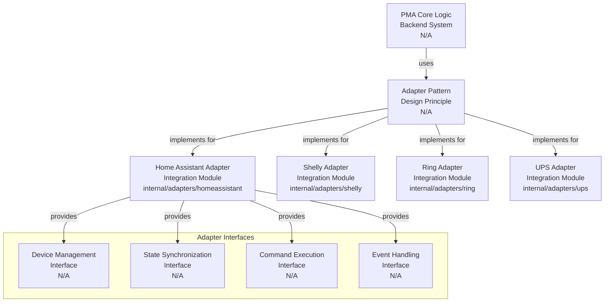
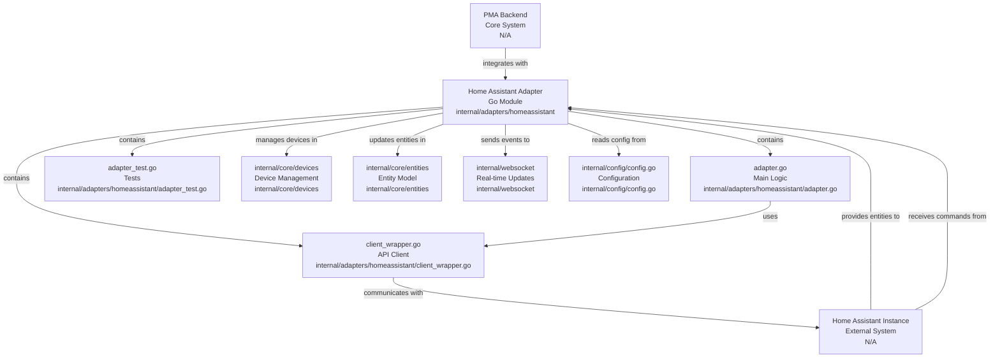

# Codebase Research Report

## Query
Investigate the "External Smart Home Systems" component in detail. Provide a comprehensive analysis of its architecture, responsibilities, and implementation details.

## Answer
# External Smart Home Systems Integration Analysis

The "External Smart Home Systems" component within the PMA backend is primarily handled by the **adapters** layer, specifically designed to integrate with various third-party smart home platforms. The most prominent example found is the **Home Assistant adapter**, located under [internal/adapters/homeassistant](internal/adapters/homeassistant). This adapter acts as a bridge, allowing the PMA system to communicate with and control devices managed by Home Assistant.

## High-Level Architecture




The integration with external smart home systems is achieved through a modular **adapter pattern**. Each external system (e.g., Home Assistant, Shelly, Ring, UPS) has its own dedicated adapter. These adapters are responsible for translating PMA's internal commands and data structures into the specific protocols and APIs of the external system, and vice-versa. This design ensures loose coupling between the core PMA logic and the intricacies of various smart home platforms.

The adapters likely interact with the core PMA system through well-defined interfaces, potentially involving:
*   **Device Management:** Registering and managing devices discovered from external systems.
*   **State Synchronization:** Receiving and updating the state of devices.
*   **Command Execution:** Sending commands to external devices.
*   **Event Handling:** Processing events originating from external systems.

## Home Assistant Adapter




The **Home Assistant adapter** ([internal/adapters/homeassistant](internal/adapters/homeassistant)) is a concrete implementation of an external smart home system integration.

### Purpose

The primary purpose of the **Home Assistant adapter** is to facilitate bidirectional communication between the PMA backend and a Home Assistant instance. It enables PMA to:
*   Discover and manage entities (devices, sensors, etc.) exposed by Home Assistant.
*   Receive real-time state updates for these entities.
*   Send commands to control Home Assistant entities.
*   Potentially leverage Home Assistant's automation capabilities.

### Internal Parts

The **Home Assistant adapter** is composed of several key files that define its functionality:

*   **[adapter.go](internal/adapters/homeassistant/adapter.go)**: This file likely contains the main adapter logic, including initialization, connection management, and the core methods for interacting with Home Assistant. It defines the `HomeAssistantAdapter` struct and its methods.
*   **[client_wrapper.go](internal/adapters/homeassistant/client_wrapper.go)**: This file probably encapsulates the low-level HTTP or WebSocket client interactions with the Home Assistant API. It might provide a simplified interface for the `adapter.go` to use, abstracting away the complexities of API calls, authentication, and error handling.
*   **[adapter_test.go](internal/adapters/homeassistant/adapter_test.go)**: Contains unit and integration tests for the Home Assistant adapter, ensuring its correct functionality and interaction with a mock or actual Home Assistant instance.

### External Relationships

The **Home Assistant adapter** establishes a connection with a Home Assistant instance, typically via its REST API and/or WebSocket API. It acts as a client to the Home Assistant server. Internally, it communicates with other PMA core components, such as:

*   **[internal/core/devices](internal/core/devices)**: To register and manage devices discovered from Home Assistant.
*   **[internal/core/entities](internal/core/entities)**: To handle the state and attributes of Home Assistant entities within PMA's unified entity model.
*   **[internal/websocket](internal/websocket)**: Potentially used for real-time state updates from Home Assistant, if the adapter leverages Home Assistant's WebSocket API for event streaming.
*   **[internal/config](internal/config/config.go)**: To retrieve configuration details for connecting to Home Assistant (e.g., URL, API token).

### Implementation Details

The `HomeAssistantAdapter` in [adapter.go](internal/adapters/homeassistant/adapter.go) likely implements an interface that allows it to be managed by a higher-level adapter manager. It would handle:

*   **Connection Lifecycle:** Establishing and maintaining a connection to Home Assistant, including re-connection logic.
*   **Authentication:** Using API tokens or other methods to authenticate with Home Assistant.
*   **Entity Discovery:** Querying Home Assistant for available entities and converting them into PMA's internal device/entity representation.
*   **State Polling/WebSockets:** Regularly polling Home Assistant for state changes or subscribing to WebSocket events for real-time updates.
*   **Command Mapping:** Translating PMA commands (e.g., `turn_on`, `set_brightness`) into corresponding Home Assistant service calls.
*   **Error Handling:** Managing API errors, network issues, and other communication failures.

The `client_wrapper.go` would contain the actual HTTP requests or WebSocket message handling, parsing JSON responses, and constructing requests according to the Home Assistant API documentation.

## Other Adapters

```mermaid
graph TB
  pmaBackend["PMA Backend<br>Core System<br>N/A"]
  adaptersDir["internal/adapters/<br>Adapter Directory<br>internal/adapters"]
  haAdapter["Home Assistant Adapter<br>Integration Module<br>internal/adapters/homeassistant"]
  networkAdapter["Network Adapter<br>Integration Module<br>internal/adapters/network"]
  ringAdapter["Ring Adapter<br>Integration Module<br>internal/adapters/ring"]
  shellyAdapter["Shelly Adapter<br>Integration Module<br>internal/adapters/shelly"]
  upsAdapter["UPS Adapter<br>Integration Module<br>internal/adapters/ups"]

  pmaBackend --> |"manages"| adaptersDir
  adaptersDir --> |"contains"| haAdapter
  adaptersDir --> |"contains"| networkAdapter
  adaptersDir --> |"contains"| ringAdapter
  adaptersDir --> |"contains"| shellyAdapter
  adaptersDir --> |"contains"| upsAdapter

  haAdapter --> |"integrates"| "Home Assistant<br>External System<br>N/A"
  networkAdapter --> |"integrates"| "Network Devices/Services<br>External System<br>N/A"
  ringAdapter --> |"integrates"| "Ring Devices<br>External System<br>N/A"
  shellyAdapter --> |"integrates"| "Shelly Devices<br>External System<br>N/A"
  upsAdapter --> |"integrates"| "UPS Systems<br>External System<br>N/A"
```


The `internal/adapters` directory also contains placeholders or implementations for other external systems, indicating a broader strategy for integrating various smart home platforms:

*   **[internal/adapters/network](internal/adapters/network)**: Suggests integration with network-level devices or services.
*   **[internal/adapters/ring](internal/adapters/ring)**: Likely for integrating with Ring devices (doorbells, cameras).
*   **[internal/adapters/shelly](internal/adapters/shelly)**: For integrating with Shelly smart devices.
*   **[internal/adapters/ups](internal/adapters/ups)**: Potentially for Uninterruptible Power Supply (UPS) monitoring and control.

Each of these adapter subdirectories would follow a similar pattern to the Home Assistant adapter, providing specific implementations for their respective external systems.

---
*Generated by [CodeViz.ai](https://codeviz.ai) on 7/20/2025, 2:47:42 PM*
